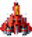

**Open Sources Software Assignment**

https://github.com/rbxo0128/Openss

main.py 로 실행

VSCODE 사용 시 폴더 열기로 게임 폴더를 열어 실행

## 게임사진

플레이어 : 방향키 또는 WASD 로 플레이어를 조종할 수 있다.

게임 플레이 사진

목숨 3개를 잃을시 게임오버

게임 오버 R키를 누르면 재시작

 - 파워 아이템 : 플레이어의 공격력을 1 올려준다

 - 목숨 아이템 : 플레이어의 목숨을 1개 늘려준다

 - 스피드 아이템 : 플레이어의 공격 속도를 올려준다

## 코드

파이썬, pygame으로 구현

## LICENSE

MIT

## REFERENCE

**Resource image sound : Raiden project(https://github.com/Margeli/Raiden1990/tree/master/Raiden%20Game/Game/Assets/Images), Strikers 1945, Free Copyright**

**Reference code : Simple plane shooter game, Suan Lab (파이썬으로 슈팅 게임 만들기)**

## UPDATE

12/05 적 Enemy2 두방 맞아야 죽게 변경, 파워 아이템 획득 시 한방

12/08 점수 3만점 이상 시 보스 추가, 죽으면 파워 - 1, 공격 속도 -1 추가, 죽을 시 무적시간 추가
