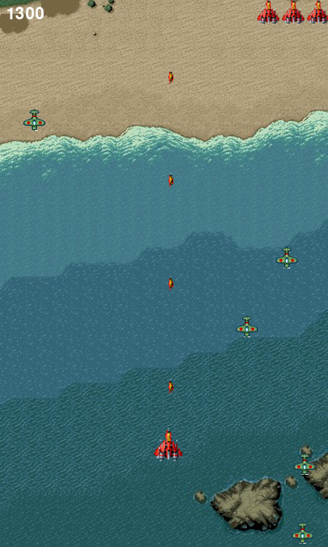
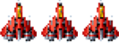
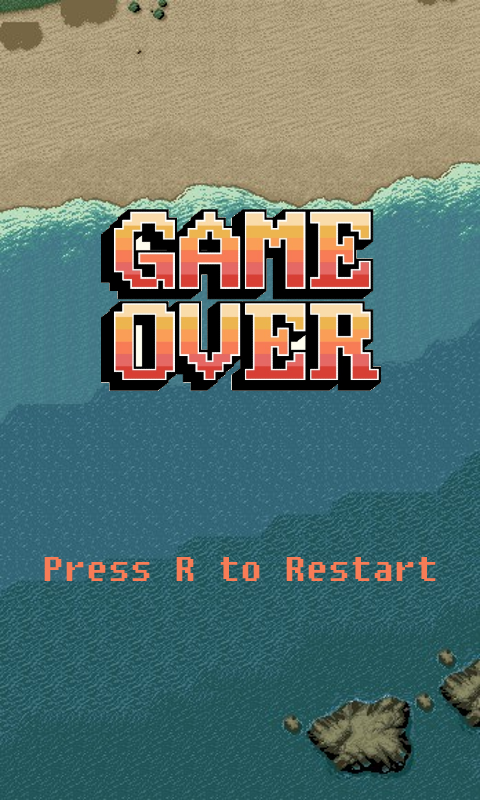

**대학교 과제**

https://github.com/rbxo0128/Openss

방향키 또는 WASD 로 플레이어를 조종할 수 있다.

게임 플레이 사진

목숨 3개를 잃을시 게임오버

게임 오버 R키를 누르면 재시작

[pitem](./resources/image/power_item.png) 파워 아이템 : 플레이어의 공격력을 1 올려준다 (적 체력 미구현)
[litem](./resources/image/life_item.png) 목숨 아이템 : 플레이어의 목숨을 1개 늘려준다
[sitem](./resources/image/speed_item.png) 스피드 아이템 : 플레이어의 공격 속도를 올려준다

Resource image sound : Raiden project, Strikers 1945, Free Copyright

